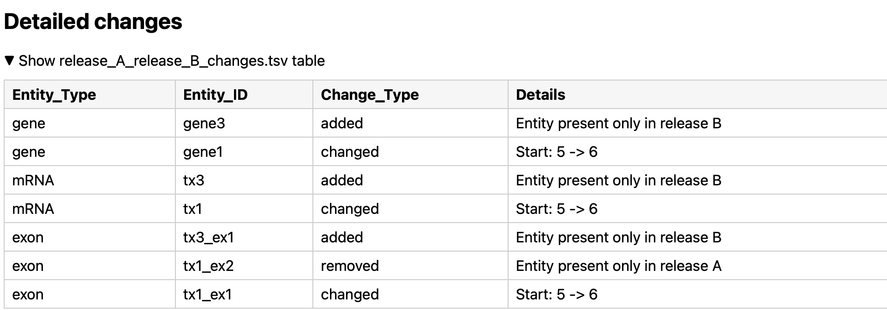

# gFFACAKE
 **GFF Annotation Change Analysis Kit for Evaluation**

A two-release GFF3 annotation comparison tool (Release A vs Release B)

Contributors: 
| Name |
|------|
| Almarc Astorga | [] (https://www.youtube.com/watch?v=dQw4w9WgXcQ&list=RDdQw4w9WgXcQ&start_radio=1)
| Ishwar Bijumon | []  (https://www.youtube.com/watch?v=dQw4w9WgXcQ&list=RDdQw4w9WgXcQ&start_radio=1)
| Krishna Sameer Krothapalli | []  (https://www.youtube.com/watch?v=dQw4w9WgXcQ&list=RDdQw4w9WgXcQ&start_radio=1)
| Saheshnu Sai Balaji Pillai | []  (https://www.youtube.com/watch?v=dQw4w9WgXcQ&list=RDdQw4w9WgXcQ&start_radio=1)

## Purpose of project
This project compares two genome annotation releases of the same organism (Release A vs Release B) to identify differences; it will produce a HTML report which includes: a summary outputs describing additions; removals; and changes across entity types between releases.

In version 1.1, a live change request was implemented to update the changes output for inclusion of a new change category: genomic coordinate shift above a threshold (based on user input). 

## Inputs
### Required 
- 'release_A.gff3': annotation release A in GFF3 format  
- 'release_B.gff3': annotation release B in GFF3 format  
### Optional 
- coordinate shift threshold: magnitude of genomic coordinate movement that should be considered biologically or analytically meaningful

### Outputs
- 'changes.tsv': one row per difference (gene/transcript/exon; added/removed/changed)
    - Entity Type, EntityID, Change Type, Details
- 'run.json': metadata logging 
- 'annotation consistency.log': log file for 
- 'added.gff3': entities present in B but not A
- 'removed.gff3': entities present in A but not B
- 'changed.gff3': 
    - entities present in both but with signature differences
    - optional threshold: genomic coordinate shift changes baased on user input
- 'summary.tsv': change counts by category and entity type for reporting 
- 'HTML page': includes provenance, overview, summary plot, counts table, artefacts and detailed changes

### Entity types
We track changes for:
- '"gene" 
- "mRNA" 
- "exon" 
- "protein_coding_gene"
-  "five_prime_UTR"
-  "three_prime_UTR"
-  "CDS"
-  "ncRNA"
-  "ncRNA_gene"
-  "pseudogene"
-  "pseudogenic_transcript"
-  "rRNA"
-  "snoRNA"
-  "snRNA"
-  "tRNA"

### Change types
- 'added'
- 'removed'
- 'changed'

### Example of changed details


# Installation
## How to install and run the software
### Option 1: Docker


### Option 2: Python + UV
Required- Python 3.10+ and uv (python environment manager)
#### Install Python

To check if Python is installed, run the following command in terminal:
```bash
python3 --version
```
If not installed:

for macOS (Homebrew)-
```bash
brew install python
```

for Ubuntu/Debian-
```bash
sudo apt update
sudo apt install python3 python3-venv python3-pip
```

for Windows-
Download from:
https://www.python.org/downloads/

Make sure python or python3 works in your terminal after installation.

#### Install uv

To install uv using pip, run the following command in terminal:
```bash
pip install uv
```
To verify installation:
```bash
uv --version
```
#### Clone the repository 

Run the following command in terminal :
```bash
git clone https://github.com/biol5472-uofglasgow/GroupG_Project.git
cd GroupG_Project
```
or use SSH key : git@github.com:biol5472-uofglasgow/GroupG_Project.git

#### Install dependencies

Use uv to install dependencies from pyproject.toml . Run the following command in terminal :
```bash
uv sync
```
This will create a virtual environment and install all required packages.

#### Running the program from the command line

Enter the following in the terminal:
```bash
uv run gffACAKE <releaseA.gff3> <releaseB.gff3> [outDir]
```
Where:
- releaseA.gff3 = first annotation file
- releaseB.gff3 = second annotation file
- outDir (optional) = directory for output files (default directory: ~/app/gffacake)


# How the software works
## Command line interface (CLI)

The user runs the program from the command line by providing:

- Annotation release A (GFF/GFF3 file)
- Annotation release B (GFF/GFF3 file)
- An optional output directory
- An optional threshold


Example fixture release command line:
```bash
uv run gffACAKE test/fixture_releases/release_A.gff3 path/fixture_releases/release_B.gff3 results/
```
Example fixture release command line with threshold input and optional results:
```bash
uv run gffACAKE test/fixture_releases/release_A.gff3 path/fixture_releases/release_B.gff3 --threshold <N>
```


Main workflow done by the CLI:
- Validates the input files
- Creates an output directory if it does not exist
- Generates a prefix from the input filenames to uniquely label output files
- Logs each step of execution to a log file for traceability

Throughout execution, the CLI:
- Logs key steps (loading data, building entities, writing outputs)
- Logs and reports errors during file writing or database creation
- Writes a log file in the output directory 

## How to run tests
All tests are located in the `tests/` directory. These include:
- **Unit tests** that validate individual functions and classes in isolation;
- **Integration-style tests** that validate higher level behaviour, including the command-line interface.

### Running Tests Locally
Tests can be run locally from the root of the repository once the project and its development dependencies have been installed.
In the terminal, enter the following code for the full suite:

```bash
uv run pytest
```

For specific files, enter:

```bash
uv -run pytest tests/test_filename.py
```

For coverage reporting:

```bash
uv run pytest --cov=annot_consistency --cov-report=term-missing
```

### Requirements
- Python >= ***3.12***

**Core Python Dependencies**
 The following runtime dependencies are required and will be installed automatically when the package is installed:
- gffutils >= ***0.13***
- matplotlib >= ***3.10***

 **Development and testing dependencies (optional)**  
  Required only for development, testing, and static analysis:
  - pytest ***>= 7.4***
  - pytest-cov ***>= 4.1***
  - mypy >= ***1.6***
  - ruff >= ***0.4***

**Docker (optional)**  
  - Docker ***>= 27.1.1***

Recommended if running the software in a containerised environment or as part of a CI / reproducible execution workflow; Docker is not required for standard local installation and testing.

Users who wish to run the tool locally only need Python ≥ 3.12 and the core dependencies, while developers contributing to the codebase should also install the optional development dependencies.
